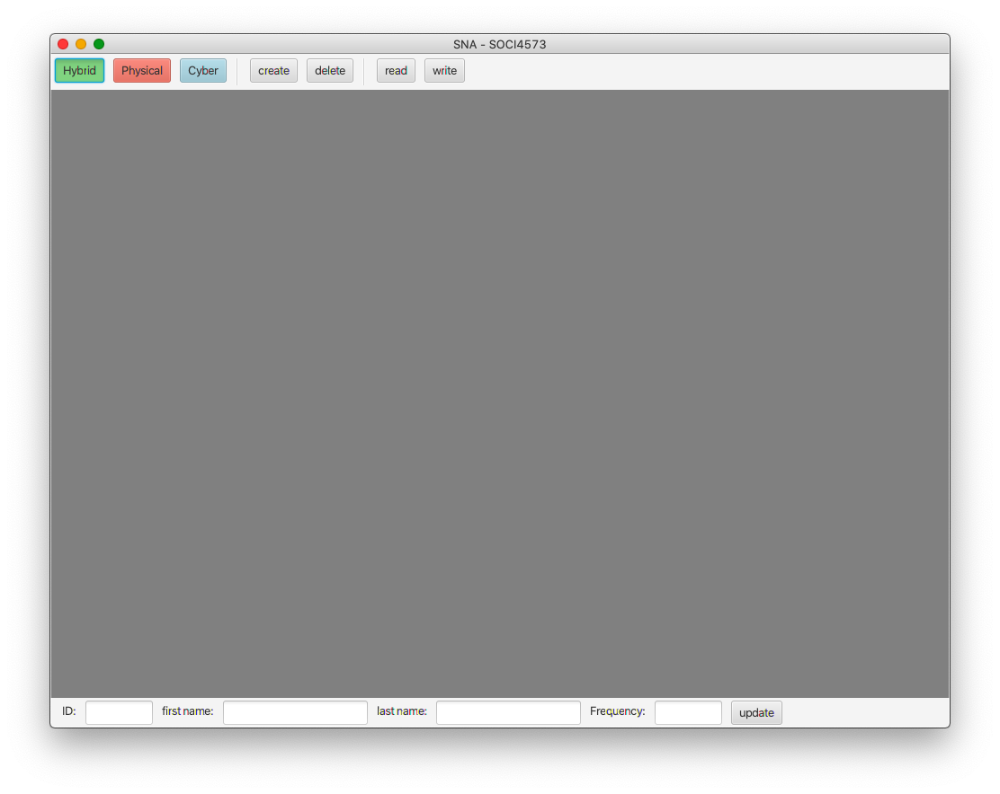
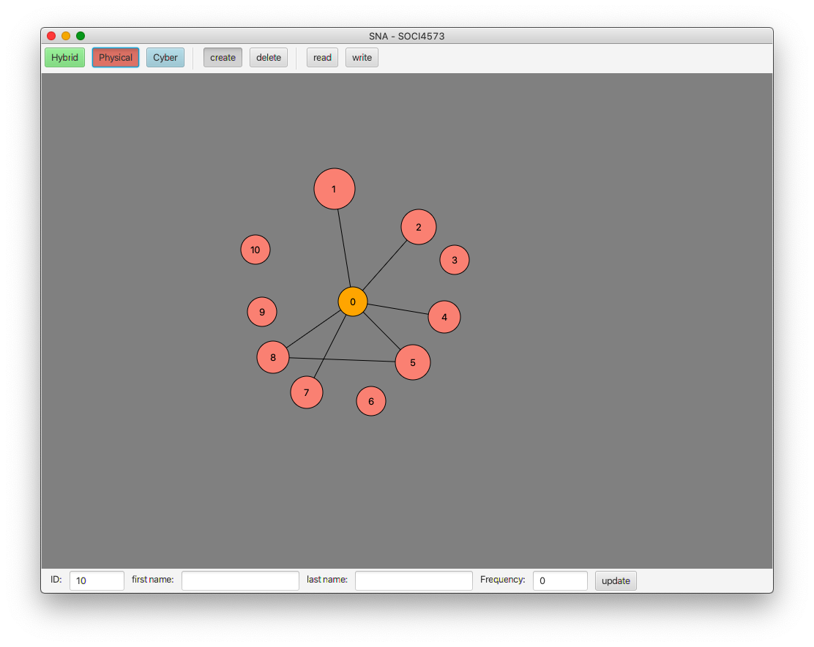
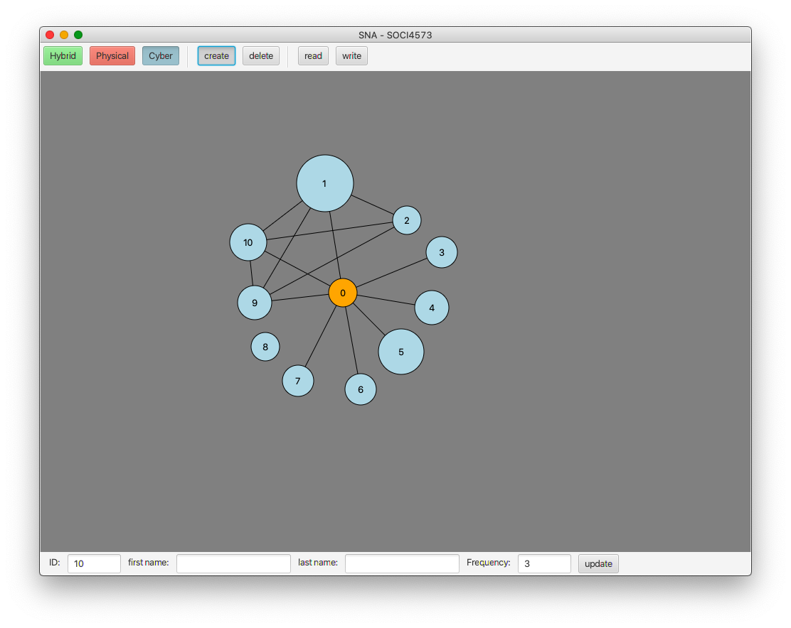
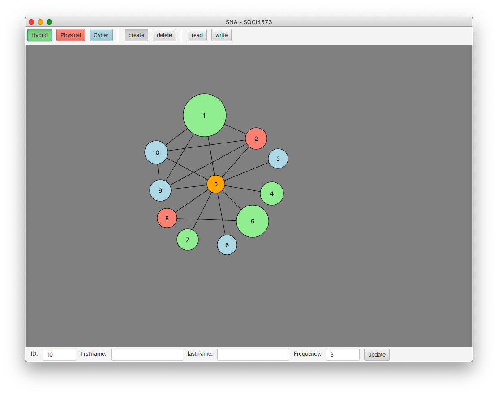
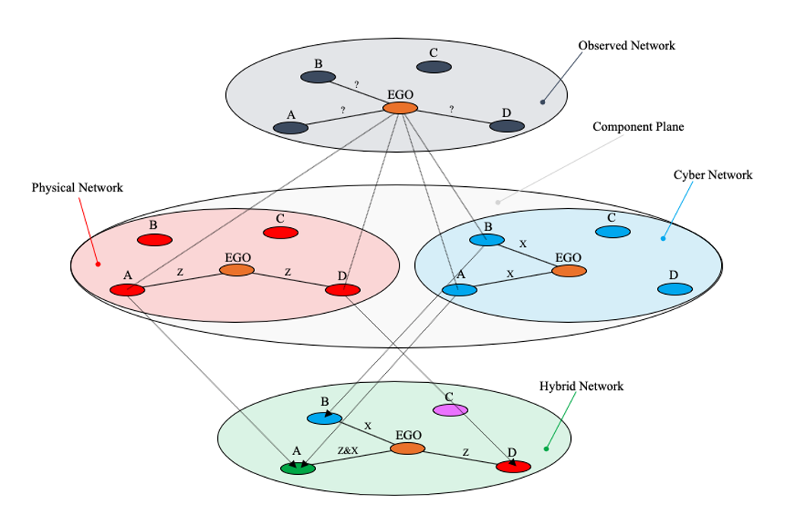

# Graph Drawer

Graph Drawer is a JavaFx desktop application designed for Undergraduate Sociologists to investigate social phenomena utilizeing Social Network Analysis. Graph Drawer specificaly attempts to model a novel theory (developed in SOCI4573) for dealing with Social Network Superposition (SNS), briefly outlined in the Exerpts section (Theoretical Application).

## Usage

To run Graph Drawer have Java installed and either type `java -jar graphDrawer.jar` in the console or navigate to the build folder and click `graphDrawer.jar` both should launch the applicaiton:

## Operations

Note: Opperations with a "\*" can only be executed in "physical" or "cyber" networks, edges created in "physical" or "cyber" only exist in that particular network. Read the exerpts section for further clarification.

\*Nodes can be added after the create mode is selected and the grey area is clicked. (The first node added is always considered the ego node)

Node attribue data can be captured by clicking a node and filling in the fields in the bottom bar and clicking update.

Nodes can be deleted after the delete mode is selected and a node in the grey area is clicked.

Nodes can be moved by click+dragging them.

\*Edges can be added in the create mode by shift+clicking a node and dragging the edge onto another node.

Data can be read in by clicking the read button.

Data can be written out or saved using the write button.

## Networks

Clicking the physical button models the physical network.

Clicking the cyber button models the cyber network.

Clicking the hybrid button models the hybrid network.

## Notes

A lightweight database approach was not used for this application since target users are Undergraduate Sociologists who likely lack advanced knowledge of such systems. Instead application data is written and read from txt files in /build/data that provide easier access and relatively no learning curve aside from understanding the data structures they model.

---

## Exerpts from SOCI4573: <em>An Analysis of Superimposed Network's in Modern Society<em> (Higgins, G. 2020)

### Introduction

"With the rise of the internet and social media over the past twenty years modern societies have become more socially connected than ever before (Can & Alatas, 2019). As a result, many individuals have been forced to rapidly integrate new cyber mediums and networks into their everyday lives (Mittal, 2018). Examples of this type of rapid integration are occurring in real-time as a response to COVID-19 that have forced people that have never held a Zoom meeting or even made a Facebook post now do so daily. However, even though many of these network mediums are different it does not necessarily follow that they only connect the same sets of individuals (Cunliffe et al., 2012). To see this simply think about people that you interact with on a daily basis. Chances are some of these individuals are accessible through both cyber and physical mediums while others are only accessible via one medium or the other (Wellman, 1994).

Regardless of the motives for the use of a specific medium, identifying which ones are being used and gathering information about them is a simple process of observation. This process involves recording what medium is being used as well as any aggregate data associated with the observed communication. The challenge with this type of analysis is assessing how each medium facilitates its own sub-network while simultaneously enabling a larger network alongside other mediums. This forms the overall research question of this project: what function do cyber and physical networks have in the creation of communication structures in modern society? In answering this question, this paper seeks to develop an early theory of Social Network Superposition (SNS) that is capable of analyzing networks and the mediums they use. This project aims to do this by applying SNS to a case study that measures how a single individual uses cyber and physical networks for academic communication."

### Theoretical Application

"...once a network is observed from an egocentric perspective, indicated by the grey network, then it can be separated into logical components or sub-networks. These components are indicated by the red (physical) and blue (cyber) networks. Once this separation process is completed the components can be superimposed or put back on top of each other, indicated by the green network.

The nodes in the resulting green network can also be categorized based on how they were connected to the ego in the previous components. If the node was connected to the ego in both the red (physical) and blue (cyber) networks, then it’s a hybrid node (green). If the node was connected to the ego in only the physical network, then it is a physical node (red). If the node was connected to the ego in only the cyber network, then it is a cyber node (blue). If the node was not connected to the ego in either network, then it is a non-node (pink). All color coding through the rest of the project follows this scheme; however, it would be redundant to consider the grey network since it is part of the initial data collection.

The purpose of this is seemingly complex process is to gain information about the initial network by looking at the components that compose it. When these components are later put back together, they can be identified within the initial network. This can enable new perspectives and conclusions to be made about the network and its various parts."
